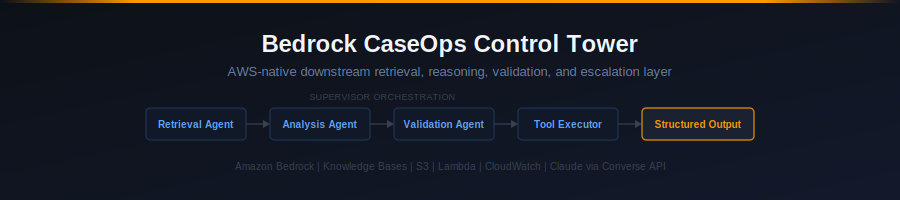

[](https://www.python.org/)
[](https://aws.amazon.com/bedrock/)
[]()
[](./tests/)
[]()

> An AWS-native, production-style multi-agent system for reviewing technical and regulatory documents using grounded retrieval, specialist agent reasoning, and citation-backed escalation-ready outputs.

---

## What This Project Does

Operational and technical teams regularly process large volumes of documents — incident reports, regulatory advisories, recall notices — where the stakes of missing something are high. Manual review is slow, inconsistent, and does not scale. Existing automation often lacks grounding: it summarizes without verifying, classifies without explaining, and escalates without a traceable rationale.

This project addresses that gap by combining retrieval-augmented generation (RAG) with a structured multi-agent pipeline that separates concerns across specialized agents, validates its own outputs, and produces auditable, citation-backed results.

---

## Positioning

This is the **downstream AWS-native reasoning layer** of the Bedrock CaseOps system. This repo owns grounded retrieval, multi-agent orchestration, output validation, escalation logic, and structured case-support outputs. Upstream document preparation belongs to the Databricks repo.

| Concern | This Repo | Databricks Lakehouse |
|---|---|---|
| Raw document ingestion and parsing | No | Yes |
| Structured field extraction | No | Yes |
| Classification and routing | No | Yes |
| Governed AI-ready asset preparation | No | Yes |
| Gold export payload delivery | Consumes | Yes |
| Grounded retrieval via Knowledge Base | Yes | No |
| Multi-agent orchestration and reasoning | Yes | No |
| Output validation and confidence scoring | Yes | No |
| Escalation logic and structured outputs | Yes | No |
| Evaluation, safety, and observability | Yes | No |

This repo does not own document transformation or upstream data structuring. Its contract is: governed document asset in, structured auditable review output out.

---

## Why Multi-Agent + Grounded Retrieval

Large language models used alone hallucinate and drift. A single-agent RAG setup lacks the separation needed to catch its own errors. This project applies a supervisor-orchestrated multi-agent pattern where:

- A **Retrieval Agent** fetches only what is actually in the knowledge base
- An **Analysis Agent** works strictly from retrieved evidence
- A **Validation Agent** audits the analysis for unsupported claims, missing citations, and confidence drift
- A **Tool Executor** handles structured actions (severity tagging, escalation triggers, output formatting)
- A **Supervisor** coordinates the full pipeline and routes exceptions

This design gives every output a traceable chain of custody from raw document to final recommendation.

---

## Architecture Summary

```
Document Intake
      │
      ▼
   S3 Storage
      │
      ▼
Bedrock Knowledge Base (indexed from S3)
      │
      ▼
Supervisor / Planner Agent
      │
      ├──► Retrieval Agent     → evidence chunks + citations
      ├──► Analysis Agent      → classification + recommendations
      ├──► Validation Agent    → output audit + confidence scoring
      └──► Tool Executor       → structured JSON output + escalation flag
      │
      ▼
   CloudWatch Logs + Outputs
```

---

## AWS Stack

| Service | Role |
|---|---|
| **Amazon S3** | Raw document storage and output archiving |
| **Amazon Bedrock** | Foundation model inference (Claude via Converse API) |
| **Amazon Bedrock Knowledge Bases** | Managed vector store and retrieval |
| **Amazon Bedrock Agents** | Agent orchestration and tool use |
| **AWS Lambda** | Serverless execution of agent workflows |
| **Amazon CloudWatch** | Logging, metrics, and observability |

---

## MVP Scope

| In Scope | Out of Scope |
|---|---|
| Document intake with metadata validation | Full CI/CD pipeline |
| S3 document storage | Frontend or web UI |
| Bedrock Knowledge Base retrieval | Auth and multi-user management |
| Multi-agent orchestration | Model fine-tuning |
| Structured JSON output with citations | Enterprise deployment infrastructure |
| Severity classification and escalation logic | Multi-region support |
| CloudWatch logging | Document format conversion (assumes clean text input) |
| CLI interface | |

---

## Repo Structure

```
bedrock-caseops-control-tower/
├── app/
│   ├── agents/          # Agent definitions and prompt logic
│   ├── services/        # AWS service clients (S3, Bedrock, KB)
│   ├── workflows/       # Orchestration and routing logic
│   ├── schemas/         # Pydantic models for structured I/O
│   ├── evaluation/      # Offline evaluation harness
│   └── utils/           # Logging, ID generation, file helpers
├── notebooks/           # Exploratory notebooks and prototypes
├── tests/               # Unit and integration tests
├── data/
│   ├── sample_documents/    # Public test documents (FDA, CISA, etc.)
│   ├── expected_outputs/    # Reference outputs for pipeline validation
│   └── evaluation/          # Curated evaluation dataset and reference outputs
├── docs/
│   └── assets/              # README assets
├── outputs/             # Runtime-generated outputs (gitignored)
├── .env.example
├── requirements.txt
├── PROJECT_SPEC.md
├── ARCHITECTURE.md
└── README.md
```

---

## Example End-to-End Workflow

1. An operator runs the CLI with a document path (e.g., an FDA warning letter in PDF or text format)
2. The intake pipeline validates metadata, assigns a document ID, and stores the file in S3
3. The Supervisor Agent receives the document reference and initiates the pipeline
4. The Retrieval Agent queries the Bedrock Knowledge Base and returns grounded evidence chunks with source citations
5. The Analysis Agent classifies severity (Critical / High / Medium / Low), assigns a category, and generates recommendations — using only the retrieved evidence
6. The Validation Agent audits the analysis output for unsupported claims and assigns a confidence score
7. The Tool Executor formats the final structured JSON output, applies escalation logic if warranted, and writes results to S3 and local outputs
8. All agent steps are logged to CloudWatch with session and document IDs for full traceability

---

## Sample Output Schema (simplified)

```json
{
  "document_id": "doc-20240315-fda-001",
  "source": "FDA Warning Letter – XYZ Facility",
  "severity": "High",
  "category": "Regulatory / Manufacturing Deficiency",
  "summary": "Facility failed to establish written procedures for equipment cleaning...",
  "recommendations": [
    "Initiate CAPA for cleaning validation gaps",
    "Escalate to compliance team within 48 hours"
  ],
  "citations": [
    {"source": "FDA Warning Letter 2024-WL-0032", "excerpt": "...no written procedures..."}
  ],
  "confidence_score": 0.87,
  "escalation_required": true,
  "validated_by": "validation-agent-v1",
  "timestamp": "2024-03-15T14:22:01Z"
}
```

---

## Why This Is a Strong Applied AI Portfolio Project

This project demonstrates a set of skills that are difficult to show with toy examples:

- **Agentic system design** — not just calling an LLM, but coordinating specialized agents with defined responsibilities
- **Grounded retrieval** — outputs tied to verifiable sources, not open-ended generation
- **Output validation** — a critic agent that audits the pipeline's own outputs
- **Production data modeling** — Pydantic schemas, structured JSON, citation tracking
- **AWS-native implementation** — real use of Bedrock, Knowledge Bases, S3, Lambda, and CloudWatch
- **Operational focus** — built around a realistic use case (regulatory / incident review) with escalation logic
- **Evaluation and observability** — structured offline evaluation harness, safety contracts, Bedrock Guardrails integration, prompt optimization, and a CloudWatch evaluation dashboard
- **Clean architecture** — modular, testable, and readable without being overengineered

---

## Data Sources

All sample documents used in this project are sourced from publicly available, legally safe data:

- [FDA Recalls and Warning Letters](https://www.fda.gov/safety/recalls-market-withdrawals-safety-alerts)
- [CISA Advisories](https://www.cisa.gov/news-events/cybersecurity-advisories)
- Public technical incident reports and post-mortems
- Synthetic cases derived from public sources

No confidential or proprietary data is used anywhere in this project.

---

## Running the CLI

### Prerequisites

Copy `.env.example` to `.env` and fill in your values:

```bash
cp .env.example .env
```

Minimum required for the full pipeline:

```
BEDROCK_KB_ID=your-knowledge-base-id
BEDROCK_MODEL_ID=anthropic.claude-3-haiku-20240307-v1:0
AWS_REGION=us-east-1
```

S3 variables are optional per step:
- `S3_DOCUMENT_BUCKET` — enables S3 upload of the raw document and intake artifact; if absent, intake runs in local-only mode.
- `S3_OUTPUT_BUCKET` — enables S3 archiving of the final JSON output to `s3://{bucket}/outputs/{document_id}/case_output.json`; if absent, output is written locally only.

### Run the full end-to-end pipeline

```bash
python -m app.cli run path/to/advisory.txt \
    --source-type FDA \
    --document-date 2026-03-30
```

With an optional submitter note (used as the KB retrieval query):

```bash
python -m app.cli run path/to/advisory.txt \
    --source-type CISA \
    --document-date 2026-03-30 \
    --submitter-note "Critical ICS vulnerability — immediate review required"
```

Supported `--source-type` values: `FDA`, `CISA`, `Incident`, `Other`

On success, the CLI prints a structured summary and writes the final JSON output to `outputs/{document_id}.json`.

### Register a document without running the pipeline

```bash
python -m app.cli intake path/to/advisory.txt \
    --source-type FDA \
    --document-date 2026-03-30
```

### Show available commands

```bash
python -m app.cli --help
python -m app.cli run --help
python -m app.cli intake --help
```

### Live AWS status

Live Bedrock / Knowledge Base validation is currently blocked by AWS-side Titan Text Embeddings V2 throttling in the target account. The full pipeline code is complete and correct; the `run` command will surface a clear failure message when AWS calls cannot be completed. All 2,119 tests pass without live AWS calls.

---

## Demo Flow (No AWS Required)

The full pipeline flow can be exercised locally without live AWS credentials using the test suite and the provided sample documents.

### Step 1: Run the test suite

```bash
pip install -r requirements.txt
python -m pytest tests/ -v
```

All 2,119 tests pass without live AWS, covering the complete pipeline across both engineering phases: intake, retrieval, analysis, validation, escalation, output writing, CLI commands, structured logging, and CloudWatch observability (Phase 1); plus the full evaluation and observability layer — offline scoring across retrieval quality, citation quality, and output quality dimensions; deterministic safety contracts and Bedrock Guardrails integration; adversarial and edge-case evaluation; prompt caching and routing optimization; baseline vs. optimized comparison workflows; CloudWatch evaluation dashboard; local evaluation artifact reporting; and the Phase 2 hardening checkpoint (Phase 2).

### Step 2: Explore sample inputs

Sample documents are in `data/sample_documents/`:

```
data/sample_documents/
├── fda_warning_letter_01.md   — FDA warning letter (quality system deficiencies)
├── fda_recall_01.md           — FDA voluntary recall (undeclared ingredients)
├── cisa_advisory_01.md        — CISA #StopRansomware advisory
└── sample_notice.txt          — Minimal synthetic test notice
```

### Step 3: Explore expected outputs

Reference output fixtures matching the `CaseOutput` schema are in `data/expected_outputs/`:

```
data/expected_outputs/
├── README.md                          — explains the fixture format
├── fda_warning_letter_01_expected.json
└── cisa_advisory_01_expected.json
```

These fixtures are controlled reference outputs — **not** live AWS outputs. See `data/expected_outputs/README.md` for details.

### Step 4: Run the intake command locally (no AWS needed)

The `intake` command validates and registers a document without requiring any AWS services:

```bash
python -m app.cli intake data/sample_documents/fda_warning_letter_01.md \
    --source-type FDA \
    --document-date 2026-03-30
```

Expected output:
```
[ok] Registration complete.
     document_id  : doc-20260330-xxxxxxxx
     artifact     : outputs/intake/doc-20260330-xxxxxxxx.json
     storage      : local only
```

### Step 5: Run the full pipeline (requires live AWS)

When AWS credentials, a provisioned Knowledge Base, and a Bedrock model are available:

```bash
python -m app.cli run data/sample_documents/fda_warning_letter_01.md \
    --source-type FDA \
    --document-date 2026-03-30 \
    --submitter-note "FDA warning letter — quality system deficiencies"
```

On success, the CLI prints a structured summary and writes a JSON output to `outputs/{document_id}.json`.

> **Live AWS status:** Live Bedrock / Knowledge Base validation is currently blocked by AWS-side Titan Text Embeddings V2 throttling. The `run` command will fail with a clear `[error]` and `[hint]` message when live AWS calls cannot complete.

---

## Project Status

**Phase 1 — Core Multi-Agent MVP:** Complete. The full pipeline is implemented and test-complete: document intake, grounded retrieval via Bedrock Knowledge Bases, multi-agent analysis and validation, escalation logic, structured JSON output with citations, CLI interface, and CloudWatch observability.

**Phase 2 — Evaluation, Safety, Optimization, and Observability:** Complete. This phase added a structured offline evaluation harness (retrieval quality metrics, citation quality scoring, composite output quality scoring), deterministic safety contracts with Bedrock Guardrails integration, an adversarial and edge-case evaluation suite, prompt caching and routing optimization layers, baseline vs. optimized comparison workflows, a CloudWatch evaluation dashboard, and local evaluation artifact reporting with a final hardening checkpoint.

**Current state:** All 2,119 tests pass without live AWS calls. The architecture and implementation are complete. Live end-to-end validation against a provisioned Bedrock Knowledge Base remains pending due to an AWS-side Titan Text Embeddings V2 throttling constraint in the target account — this is an external runtime blocker, not a code issue.

For the full implementation history, phased roadmap, and detailed architecture decisions, see [PROJECT_SPEC.md](PROJECT_SPEC.md) and [ARCHITECTURE.md](ARCHITECTURE.md).

---

## Connected Repositories

This repo is the **downstream** component of a two-repository architecture. The boundary between them is intentional and non-negotiable.

| Repository | Role |
|---|---|
| [**databricks-caseops-lakehouse**](https://github.com/NavidBroumandfar/databricks-caseops-lakehouse) | Upstream — governed document ingestion, parsing, extraction, classification, and AI-ready asset preparation on the Databricks Lakehouse platform |
| **bedrock-caseops-control-tower** *(this repo)* | Downstream — grounded retrieval, multi-agent reasoning, output validation, escalation, and structured review generation on AWS Bedrock |

The handoff point between these systems is the formal **Gold export payload** — a schema-versioned, contract-enforced structured record produced by the Databricks repo and consumed by this repo. This repo does not own document transformation, extraction, or upstream data structuring. Those concerns belong entirely to the Databricks Lakehouse.

---

## Let's Connect

If you're exploring this project, interested in agentic AI systems and AWS Bedrock architecture, or open to discussing applied AI and cloud engineering roles — feel free to reach out.

&nbsp;

[](https://www.linkedin.com/in/navid-broomandfar/)
[](https://github.com/NavidBroumandfar)
[](mailto:broomandnavid@gmail.com)

&nbsp;

---

*This project was developed with AI-assisted workflows. Architecture, agent design, schema contracts, evaluation logic, and safety policy definitions remained intentional throughout; AI tooling supported the implementation workflow as part of a modern development practice.*
