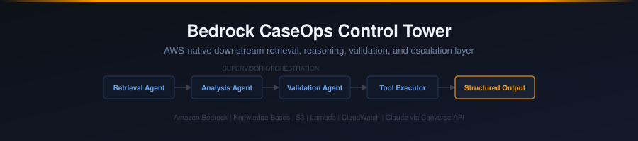
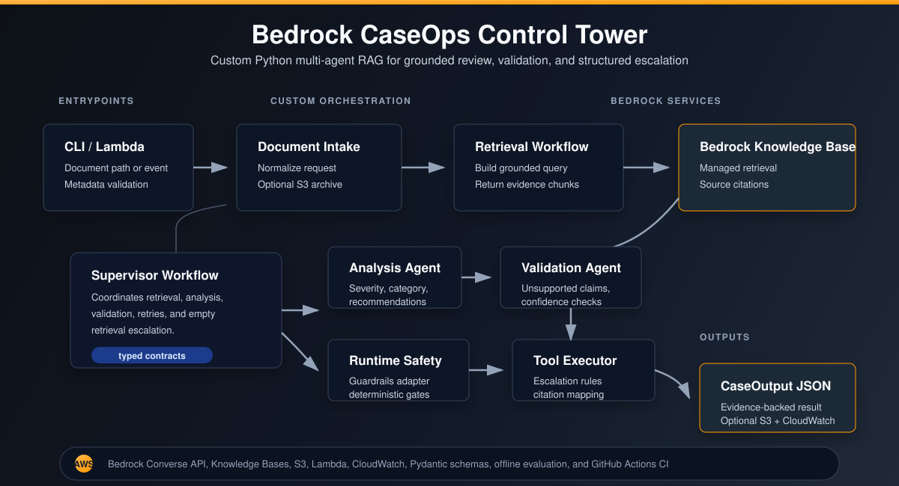

[](https://www.python.org/)
[](https://aws.amazon.com/bedrock/)
[]()
[](./tests/)
[](https://github.com/NavidBroumandfar/bedrock-caseops-control-tower/actions/workflows/tests.yml)
[](LICENSE)
[]()

> A Bedrock-powered custom Python multi-agent RAG pipeline for high-stakes document review — grounded retrieval, evidence-backed analysis, validation, and structured escalation, traceable from source document to final recommendation.



**At a glance:** the project accepts a document through the CLI or Lambda, retrieves grounded evidence from a Bedrock Knowledge Base, runs analysis and validation through Bedrock Converse, applies deterministic safety and escalation gates, and emits structured `CaseOutput` JSON with citations.

---

## What This Project Does

Operational and technical teams regularly process large volumes of high-stakes documents — FDA warning letters, CISA advisories, incident reports, recall notices — where the cost of a missed classification, an unsupported recommendation, or an untraced escalation is real. Manual review does not scale. Existing AI automation often makes things worse: it summarizes without verifying, classifies without explaining, and escalates without a rationale that anyone can audit.

This project addresses that gap with a deliberately structured multi-agent pipeline: specialized Python components for retrieval, analysis, validation, and escalation, each with a defined scope and responsibility. Outputs carry retrieved-evidence citations, validation confidence, and escalation rationale so review results are auditable rather than just automated.

---

## Positioning

This is the **downstream Bedrock-powered reasoning layer** of the Bedrock CaseOps system. This repo owns grounded retrieval, custom Python orchestration, output validation, escalation logic, and structured case-support outputs. Upstream document preparation belongs to the Databricks repo.

| Concern | This Repo | Databricks Lakehouse |
|---|---|---|
| Raw document ingestion and parsing | No | Yes |
| Structured field extraction | No | Yes |
| Classification and routing | No | Yes |
| Governed AI-ready asset preparation | No | Yes |
| Gold export payload delivery | Consumes | Yes |
| Grounded retrieval via Knowledge Base | Yes | No |
| Custom Python multi-agent orchestration and reasoning | Yes | No |
| Output validation and confidence scoring | Yes | No |
| Escalation logic and structured outputs | Yes | No |
| Evaluation, safety, and observability | Yes | No |

This repo does not own document transformation or upstream data structuring. Its contract is: governed document asset in, structured auditable review output out.

---

## Why Multi-Agent + Grounded Retrieval

Large language models used alone hallucinate and drift. A single-agent RAG setup lacks the separation needed to catch its own errors. This project applies a supervisor-orchestrated multi-agent pattern where:

- A **Retrieval Agent** fetches only what is actually in the knowledge base
- An **Analysis Agent** works strictly from retrieved evidence
- A **Validation Agent** audits the analysis for unsupported claims, missing citations, and confidence drift
- A **Tool Executor** handles structured actions (severity tagging, escalation triggers, output formatting)
- A **Supervisor** coordinates the full pipeline and routes exceptions

This design gives every output a traceable chain of custody from raw document to final recommendation.

---

## Architecture Summary

```
CLI / Lambda
      │
      ▼
Document Intake
      │
      ├── optional S3 document archive
      │
      ▼
Retrieval Workflow → Bedrock Knowledge Base
      │
      ▼
Supervisor Workflow
      │
      ├──► Analysis Agent      → Bedrock Converse
      ├──► Validation Agent    → Bedrock Converse
      └──► Tool Executor Agent → structured JSON output + escalation flag
      │
      ▼
Local outputs + optional S3 archive + optional CloudWatch logs
```

The agents in this repository are application-level Python classes and workflows. The current implementation does **not** define native Amazon Bedrock Agents, agent aliases, action groups, or `invoke_agent` calls. A Lambda handler and AWS SAM deployment foundation are available for the custom pipeline. See [agents.md](agents.md) for the current agent inventory and [ROADMAP.md](ROADMAP.md) for the planned evolution.

---

## AWS Service Usage

| Service | Role |
|---|---|
| **Amazon S3** | Optional raw document upload and optional final output archiving; SAM deployment creates document and output buckets |
| **Amazon Bedrock** | Foundation model inference through the Converse API |
| **Amazon Bedrock Knowledge Bases** | Managed vector store and retrieval |
| **Amazon CloudWatch** | Optional structured logging and evaluation metrics when enabled |

Implemented deployment foundation: Lambda-compatible handler, AWS SAM template, narrow IAM policy statements, deployment guide, sample Lambda events, and pull-request test CI. Dev, staging, and production infrastructure have been live-validated, including one production synthetic canary. Not implemented today: native Amazon Bedrock Agents or a real production traffic launch. The current runtime remains a custom Python orchestration layer that calls Bedrock services directly through boto3-backed service classes.

Architecture decision: the mainline project will stay on custom Bedrock-powered Python orchestration. Native Bedrock Agents are deferred to a future proof of concept only if a concrete requirement calls for them. See [ADR 0001](docs/adr/0001-keep-custom-bedrock-orchestration.md).

## Public Release Posture

This repository is public-safe as a reference implementation. It does not
include AWS credentials, a committed `.env`, private Lambda response payloads,
generated S3 artifacts, or account-specific validation logs. Live validation
evidence is published in sanitized form.

Another user can reuse the runtime, tests, SAM template, and deployment helpers
in their own AWS account. They must bring their own Bedrock model access,
Bedrock Knowledge Base, indexed source documents, and optional Guardrail. See
[docs/public-release.md](docs/public-release.md),
[docs/aws-bootstrap.md](docs/aws-bootstrap.md), and [SECURITY.md](SECURITY.md).

---

## MVP Scope

| In Scope | Out of Scope |
|---|---|
| Document intake with metadata validation | Full CI/CD pipeline |
| Optional S3 document storage and output archiving | Frontend or web UI |
| Bedrock Knowledge Base retrieval | Auth and multi-user management |
| Custom Python multi-agent orchestration | Model fine-tuning |
| Structured JSON output with citations | Enterprise deployment infrastructure |
| Severity classification and escalation logic | Multi-region support |
| Optional CloudWatch logging | Document format conversion (assumes clean text input) |
| CLI interface and Lambda deployment foundation | |

---

## Repo Structure

```
bedrock-caseops-control-tower/
├── app/
│   ├── agents/          # Agent definitions and prompt logic
│   ├── services/        # AWS service clients (S3, Bedrock, KB)
│   ├── workflows/       # Orchestration and routing logic
│   ├── schemas/         # Pydantic models for structured I/O
│   ├── evaluation/      # Offline evaluation harness
│   └── utils/           # Logging, ID generation, file helpers
├── notebooks/           # Exploratory notebooks and prototypes
├── tests/               # Unit and integration tests
├── data/
│   ├── sample_documents/    # Public test documents (FDA, CISA, etc.)
│   ├── expected_outputs/    # Reference outputs for pipeline validation
│   └── evaluation/          # Curated evaluation dataset and reference outputs
├── docs/
│   └── assets/              # README assets
├── outputs/             # Runtime-generated outputs (gitignored)
├── .env.example
├── CODE_OF_CONDUCT.md
├── CONTRIBUTING.md
├── LICENSE
├── Makefile
├── pyproject.toml
├── requirements.txt
├── SECURITY.md
├── agents.md
├── ROADMAP.md
├── PROJECT_SPEC.md
├── ARCHITECTURE.md
└── README.md
```

---

## Example End-to-End Workflow

1. An operator runs the CLI with a document path (e.g., an FDA warning letter in text or markdown format)
2. The intake pipeline validates metadata, assigns a document ID, and optionally stores the file in S3 when `S3_DOCUMENT_BUCKET` is configured
3. The supervisor workflow receives the document reference and initiates the pipeline
4. The retrieval workflow queries the Bedrock Knowledge Base and returns grounded evidence chunks with source citations
5. The Analysis Agent classifies severity (Critical / High / Medium / Low), assigns a category, and generates recommendations using retrieved evidence
6. The Validation Agent audits the analysis output for unsupported claims and assigns a confidence score
7. The Tool Executor Agent formats the final structured JSON output, applies escalation logic if warranted, and writes local output with optional S3 archiving
8. Pipeline steps are logged locally and optionally emitted to CloudWatch when `CASEOPS_ENABLE_CLOUDWATCH=true`

---

## Sample Output Schema (simplified)

```json
{
  "document_id": "doc-20240315-fda-001",
  "source": "FDA Warning Letter – XYZ Facility",
  "severity": "High",
  "category": "Regulatory / Manufacturing Deficiency",
  "summary": "Facility failed to establish written procedures for equipment cleaning...",
  "recommendations": [
    "Initiate CAPA for cleaning validation gaps",
    "Escalate to compliance team within 48 hours"
  ],
  "citations": [
    {"source": "FDA Warning Letter 2024-WL-0032", "excerpt": "...no written procedures..."}
  ],
  "confidence_score": 0.87,
  "escalation_required": true,
  "validated_by": "validation-agent-v1",
  "timestamp": "2024-03-15T14:22:01Z"
}
```

---

## What This Demonstrates

This project tackles a set of applied AI engineering problems that are hard to show with toy examples:

- **Agentic system design** — a supervisor-coordinated custom Python multi-agent hierarchy, not a single prompt chain; each agent has a defined scope and typed contract
- **Grounded retrieval** — generated outputs carry Knowledge Base citations plus claim-level grounded-claim and validation metadata
- **Self-validating outputs** — a dedicated Validation Agent audits every analysis for unsupported claims, missing citations, and confidence drift before the output is accepted
- **Structured escalation** — escalation is rule-driven and explainable: severity, confidence threshold, unsupported claims, and explicit recommendations all feed into a deterministic escalation decision
- **Production-grade data modeling** — Pydantic schemas enforce contract boundaries between every agent; structured JSON with full citation tracking throughout
- **Bedrock service integration** — Bedrock Converse, Bedrock Knowledge Bases, optional S3, and optional CloudWatch integrations through explicit service boundaries
- **Evaluation and observability** — offline evaluation harness across retrieval quality, citation quality, and output quality; deterministic safety contracts; Guardrails configuration and tests; CloudWatch evaluation dashboard support; adversarial and edge-case test coverage
- **Clean, readable architecture** — modular, testable, and decoupled without being over-engineered

---

## Data Sources

All sample documents used in this project are sourced from publicly available, legally safe data:

- [FDA Recalls and Warning Letters](https://www.fda.gov/safety/recalls-market-withdrawals-safety-alerts)
- [CISA Advisories](https://www.cisa.gov/news-events/cybersecurity-advisories)
- Public technical incident reports and post-mortems
- Synthetic cases derived from public sources

No confidential or proprietary data is used anywhere in this project.

---

## Running the CLI

### Prerequisites

Create and activate a local virtual environment:

```bash
python3 -m venv .venv
source .venv/bin/activate
python3 -m pip install --upgrade pip
python3 -m pip install -r requirements.txt
```

Copy `.env.example` to `.env` and fill in your values:

```bash
cp .env.example .env
```

Minimum required for the full pipeline:

```
BEDROCK_KB_ID=your-knowledge-base-id
BEDROCK_MODEL_ID=anthropic.claude-3-haiku-20240307-v1:0
AWS_REGION=us-east-1
```

The CLI loads `.env` automatically from the current working directory tree. Existing shell environment variables take precedence over `.env` values.

S3 variables are optional per step:
- `S3_DOCUMENT_BUCKET` — enables S3 upload of the raw document and intake artifact; if absent, intake runs in local-only mode.
- `S3_OUTPUT_BUCKET` — enables S3 archiving of the final JSON output to `s3://{bucket}/outputs/{document_id}/case_output.json`; if absent, output is written locally only.

Check local configuration without making AWS calls:

```bash
python3 -m app.cli doctor
python3 -m app.cli check-config
```

### Run the full end-to-end pipeline

```bash
python3 -m app.cli run path/to/advisory.txt \
    --source-type FDA \
    --document-date 2026-03-30
```

With an optional submitter note (used as the KB retrieval query):

```bash
python3 -m app.cli run path/to/advisory.txt \
    --source-type CISA \
    --document-date 2026-03-30 \
    --submitter-note "Critical ICS vulnerability — immediate review required"
```

Supported `--source-type` values: `FDA`, `CISA`, `Incident`, `Other`

On success, the CLI prints a structured summary and writes the final JSON output to `outputs/{document_id}.json`.

### Register a document without running the pipeline

```bash
python3 -m app.cli intake path/to/advisory.txt \
    --source-type FDA \
    --document-date 2026-03-30
```

### Register a Databricks Gold export payload without running the pipeline

```bash
python3 -m app.cli intake-gold tests/fixtures/databricks_gold/sample_gold_payload.json
```

This validates one local, schema-versioned Gold export record and converts it into the same `IntakeResult` handoff used by the normal Bedrock intake path. It does not call Databricks, Delta Share, Bedrock, Knowledge Bases, S3, or the agent pipeline.

The first local downstream workflow after intake creates a deterministic case work item from `IntakeResult`; see [docs/case-work-item-workflow.md](docs/case-work-item-workflow.md).

### Show available commands

```bash
python3 -m app.cli --help
python3 -m app.cli doctor
python3 -m app.cli run --help
python3 -m app.cli intake --help
```

Common shortcuts are available through `make`:

```bash
make test
make cli-help
make doctor
make intake-sample
make live-smoke
```

For AWS account preparation, see [docs/aws-bootstrap.md](docs/aws-bootstrap.md).
For Lambda/SAM deployment, see [docs/deployment.md](docs/deployment.md).

### Live AWS status

Live Bedrock / Knowledge Base validation completed on 2026-06-06. Dev and staging Lambda validation completed on 2026-06-07. One production synthetic canary completed successfully, and `production_traffic_launched=false` remains the final release state. Public validation evidence is sanitized. The `run` command will surface a clear failure message when required config, AWS credentials, model access, Guardrails, or Knowledge Base retrieval are unavailable. The offline test suite validates the custom Python runtime without live AWS calls.

---

## Demo Flow (No AWS Required)

The full pipeline flow can be exercised locally without live AWS credentials using the test suite and the provided sample documents.

### Step 1: Run the test suite

```bash
python3 -m pip install -r requirements.txt
python3 -m pytest tests/ -v
```

The offline suite passes without live AWS and covers intake, retrieval contracts, analysis, validation, escalation, output writing, CLI commands, structured logging, optional CloudWatch paths, evaluation scoring, deterministic safety contracts, runtime prompt caching/routing wiring, comparison workflows, and local reporting.

### Step 2: Explore sample inputs

Sample documents are in `data/sample_documents/`:

```
data/sample_documents/
├── fda_warning_letter_01.md   — FDA warning letter (quality system deficiencies)
├── fda_recall_01.md           — FDA voluntary recall (undeclared ingredients)
├── cisa_advisory_01.md        — CISA #StopRansomware advisory
└── sample_notice.txt          — Minimal synthetic test notice
```

### Step 3: Explore expected outputs

Reference output fixtures matching the `CaseOutput` schema are in `data/expected_outputs/`:

```
data/expected_outputs/
├── README.md                          — explains the fixture format
├── fda_warning_letter_01_expected.json
└── cisa_advisory_01_expected.json
```

These fixtures are controlled reference outputs — **not** live AWS outputs. See `data/expected_outputs/README.md` for details.

### Step 4: Run local evaluation workflows

Evaluation commands score saved `CaseOutput` JSON files and write artifacts under `outputs/`:

```bash
python3 -m app.cli eval safety
python3 -m app.cli eval dashboard
python3 -m app.cli eval compare \
    --baseline-dir outputs/baseline_candidates \
    --optimized-dir outputs/optimized_candidates
```

For the candidate directory convention and baseline-vs-optimized workflow, see [docs/evaluation-workflow.md](docs/evaluation-workflow.md).

### Step 5: Run the intake command locally (no AWS needed)

The `intake` command validates and registers a document without requiring any AWS services:

```bash
python3 -m app.cli intake data/sample_documents/fda_warning_letter_01.md \
    --source-type FDA \
    --document-date 2026-03-30
```

Expected output:
```
[ok] Registration complete.
     document_id  : doc-20260330-xxxxxxxx
     artifact     : outputs/intake/doc-20260330-xxxxxxxx.json
     storage      : local only
```

### Step 6: Run the full pipeline (requires live AWS)

When AWS credentials, a provisioned Knowledge Base, and a Bedrock model are available:

```bash
python3 -m app.cli run data/sample_documents/fda_warning_letter_01.md \
    --source-type FDA \
    --document-date 2026-03-30 \
    --submitter-note "FDA warning letter — quality system deficiencies"
```

On success, the CLI prints a structured summary and writes a JSON output to `outputs/{document_id}.json`.

> **Live AWS status:** Dev and staging live validation completed on 2026-06-07. Production infrastructure was deployed and one synthetic production canary passed. Real production traffic has not been launched; `production_traffic_launched=false` is the final recorded state. See [docs/live-validation.md](docs/live-validation.md) for sanitized evidence and caveats.

---

## Project Status

**Phase 1 — Core Multi-Agent MVP:** Implemented and offline-validated. The custom Python pipeline includes document intake, grounded retrieval via Bedrock Knowledge Bases, analysis and validation agents, escalation logic, structured JSON output with citations, CLI interface, and optional CloudWatch observability.

**Phase 2 — Evaluation, Safety, Optimization, and Observability:** Implemented as testable modules with runtime config wiring for prompt caching, prompt routing, retry count, and escalation threshold. This phase added a structured offline evaluation harness, deterministic safety contracts, Guardrails configuration and adapters, adversarial and edge-case evaluation, prompt caching and routing modules, baseline vs. optimized comparison workflows, a CloudWatch evaluation dashboard definition, and local evaluation artifact reporting.

**Phase 6 — Evaluation as an Operator Workflow:** Implemented. The CLI now exposes `eval run`, `eval safety`, `eval compare`, and `eval dashboard`; artifacts are written under `outputs/`; optional CloudWatch metric publication is controlled by `CASEOPS_ENABLE_EVALUATION_METRICS`.

**Phase 7 — Deployment Foundation:** Implemented and live-validated. The repository now includes a Lambda-compatible handler, AWS SAM template, narrow IAM policy definitions, dev/staging deployment docs, sample invocation events, CloudWatch monitoring resources, and GitHub Actions PR test CI.

**Phase 8 — Native Bedrock Agents Decision:** Accepted. The project remains custom Bedrock-powered Python orchestration; native Bedrock Agents are deferred to a future proof of concept only if needed. See [ADR 0001](docs/adr/0001-keep-custom-bedrock-orchestration.md).

**Phase 10 — Production Readiness and Operationalization:** Completed. Repeatable dev/staging deployment helpers, operational validation checks, staging Knowledge Base isolation, live Guardrails allow/block validation, CloudWatch metric filters/alarms, and a production-readiness release gate are in place.

**Phase 16 — Production Synthetic Canary:** Completed. The production stack, production Knowledge Base, production Guardrail, production output bucket, Lambda response, S3 archive, Lambda logs, structured pipeline logs, and runtime safety status were verified with exactly one synthetic canary. Public docs intentionally redact account-specific resource identifiers.

**Phase 17 — Final Handoff and Project Freeze:** Completed. The project is considered complete for portfolio and handoff purposes. Real production traffic launch is intentionally out of scope unless a future operator explicitly chooses to run it.

**Current state:** The repository is a live-validated custom Bedrock-powered orchestration system with repeatable Lambda deployment, production readiness validation, and one successful production synthetic canary. Native Bedrock Agent deployment and real production traffic launch are intentionally not implemented in the mainline architecture.

For the current agent inventory and implementation gaps, see [agents.md](agents.md). For the phased roadmap, see [ROADMAP.md](ROADMAP.md). For the final freeze state, see [docs/project-closeout.md](docs/project-closeout.md). For public reuse and security posture, see [docs/public-release.md](docs/public-release.md) and [SECURITY.md](SECURITY.md). Older detailed design notes live in [PROJECT_SPEC.md](PROJECT_SPEC.md) and [ARCHITECTURE.md](ARCHITECTURE.md); where they conflict with the current status, prefer `agents.md`, `ROADMAP.md`, `docs/project-closeout.md`, and `docs/public-release.md`.

---

## Connected Repositories

This repo is the **downstream** component of a two-repository architecture. The boundary between them is intentional and non-negotiable.

| Repository | Role |
|---|---|
| [**databricks-caseops-lakehouse**](https://github.com/NavidBroumandfar/databricks-caseops-lakehouse) | Upstream — governed document ingestion, parsing, extraction, classification, and AI-ready asset preparation on the Databricks Lakehouse platform |
| **bedrock-caseops-control-tower** *(this repo)* | Downstream — grounded retrieval, multi-agent reasoning, output validation, escalation, and structured review generation on AWS Bedrock |

The handoff point between these systems is the formal **Gold export payload** — a schema-versioned, contract-enforced structured record produced by the Databricks repo and consumed by this repo. The first Bedrock-side local consumer adapter is documented in [docs/databricks-gold-handoff.md](docs/databricks-gold-handoff.md). This repo does not own document transformation, extraction, or upstream data structuring. Those concerns belong entirely to the Databricks Lakehouse.

---

## Let's Connect

If you're exploring this project, working on agentic AI systems or AWS Bedrock architecture, or open to discussing applied AI and cloud engineering roles — I'd be glad to connect.

&nbsp;

[](https://www.linkedin.com/in/navid-broomandfar/)
[](https://github.com/NavidBroumandfar)

---

This project was developed with AI-assisted workflows. The system architecture, agent design, schema contracts, evaluation framework, and safety boundaries were intentionally designed and directed by the author, with AI tooling used to support and accelerate implementation as part of a modern engineering workflow.
